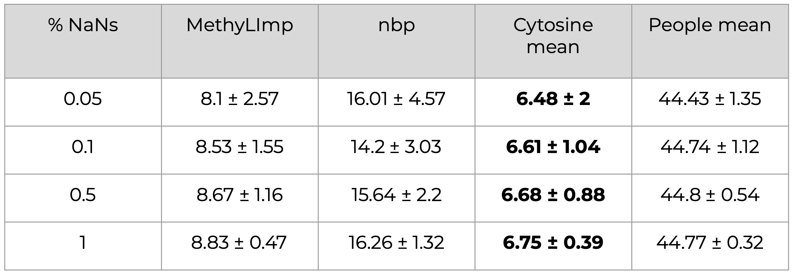
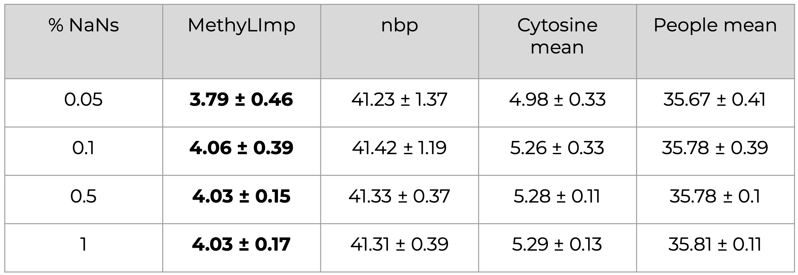
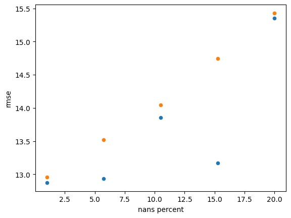
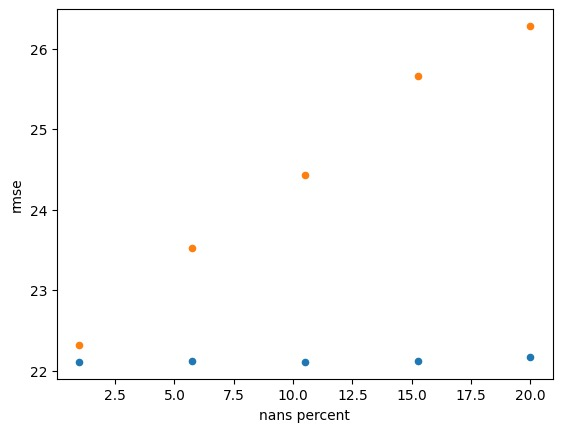
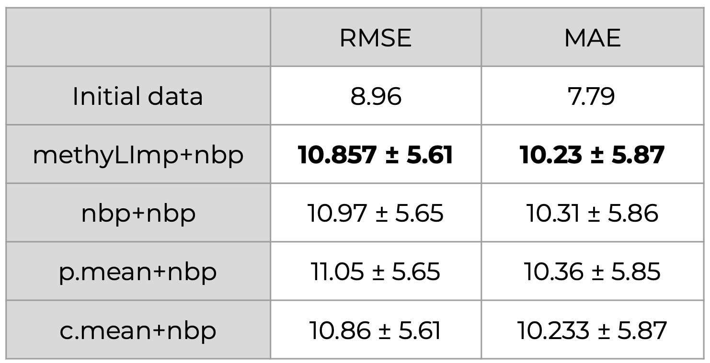

# Development of DNA methylation data imputation algorithm for RRBS and WGBS protocols

Authors:
* Oleg Shpynov
* Roman Chernyatchik
* Emiliia Lekhman

## Usage

```
python3 code/inpute_horvath_features.py <file_path>
```

The script imputes Horvath's markers and saves them in `data/horvath_features.tsv`.
The input file should contain markers as rows and samples as columns. The mathylation values must be in range from 0 to 100. 
The output file contains only Horvath's markers, which are ranged from 0 to 1.

## Abstract

DNA methylation, an essential epigenetic modification, plays a crucial role in gene regulation and various biological processes. However, DNA methylation datasets often
contain missing values, which present challenges for subsequent analysis. Missing values reduce the accuracy of methylation clocks, which are predictive models utilized to
estimate biological age based on DNA methylation patterns. Accordingly, this thesis focuses on suggesting and implementing an imputation algorithm to address the problem
of missing values.

Four imputation algorithms, named nbp, methyLImp, cytosine mean, and people
mean, were evaluated for missing value imputation. MethyLImp consistently outperformed other methods in terms of accuracy and efficiency, offering a robust solution for
restoring missing values.

Furthermore, methylation clocks, which predict chronological age based on DNA methylation patterns, were estimated using combination algorithms such as cytosine mean +
nbp, people mean + nbp, nbp + nbp, and methyLImp + nbp. MethyLImp + nbp exhibited
superior performance, emphasizing the significance of incorporating methyLImp in the
imputation process for accurate age estimation.

By conducting multiple launches of the evaluation process, the study ensured the robustness and consistency of the methylation clocks with usage of combination algorithms,
enhancing the reliability of the results.

The proposed algorithm offers a robust DNA methylation imputation approach, enabling
the evaluation of DNA methylation clocks designed for DNA microarrays to be applied to
datasets obtained using Next Generation Sequencing technologies.

## Goal and objectives

The goal is to suggest and implement a new RRBS/WGBS data imputation algorithm

Objectives:
* Get familiar with the DNA methylation and methylation clock models
* Investigate different approaches to apply clocks to WGBS and RRBS datasets
* Do the research about imputation methods
* Suggest and implement a new imputation method
* Build benchmarks and analyse applicability

## Results

### RRBS benchmark
The pipeline:
1. Real-world missing values are removed from a dataset
2. x% of missing values are introduced to the dataset randomly (x=0.05, 0.1, 0.5, 1)
3. These missing values are imputed using 4 algorithms (nbp, methyLImp, cytosine mean and people mean)
4. RMSE is calculated for all setups
5. Repeated 20 times



The results indicate that the nbp method outperforms the people mean approach by a significant margin. Furthermore, the results suggest that the cytosine mean method slightly
outperforms methyLImp. However, it should be noted that the efficacy of the cytosine
mean method is highly dependent on the dataset and the specific markers where missing values occur. For instance, if the dataset comprises 1 healthy control and 20 cancer
cases, and an attempt is made to impute a missing value that belongs to the healthy control group, the cytosine mean method may yield less accurate results, particularly if the
missing value being imputed exhibits a strong correlation with cancer.

The results can be obtained by running the jupyter notebook `code/benchmark_table_rrbs.ipynb`.

### Microarray benchmark
The pipeline is the same as the previous one.



The methyLImp algorithm outperforms the cytosine mean method.

The results can be obtained by running the jupyter notebook `code/benchmark_table_microarray.ipynb`.

### Combination algorithm
The pipeline:
1. Real-world missing values are removed from a RRBS and microarray datasets
2. 0.1% (~2400) of features (CpGs) is removed 
3. 1% of missing values introduced to the dataset randomly
4. Missing values are imputed using 2 methods: nbp and methyLImp
5. Features are imputed using nbp
6. Repeated 10 times




It is evident that the combined approach of methyLImp+nbp yields better performance compared to nbp+nbp. However, it is noteworthy that for a small percentage of missing values, the two approaches demonstrate similar outcomes.

The results can be obtained by running the jupyter notebook `code/combo_errors.ipynb`.

### Horvath's clock on microarray
The pipeline:
1. Only Horvath's markers are taken into consideration
2. Real-world missing values are removed from a microarray dataset (only 7 values)
3. 180 CpGs removed (out of 353)
4. Imputation with 4 combo-algorithms: cytosine mean + nbp, people mean + nbp, nbp + nbp, and methyLImp + nbp
5. RMSE and MAE calculated
6. Repeated 10 times



The results demonstrate that the combination algorithm methyLImp + nbp yields the most favorable overall performance in terms of the RMSE and MAE metrics when employed for methylation clock estimation. Notably, the observed differences between the combination algorithms are relatively minor.

The results can be obtained by running the jupyter notebook `code/horvath_microarrays.ipynb`.

## Conclusion

We have explored and evaluated various algorithms and methodologies for missing value imputation and methylation clock estimation in DNA methylation datasets. Through our discussions and analyses, several key conclusions can be drawn, shedding light on the effectiveness and implications of the proposed approaches. We implemented various combination algorithms, including cytosine mean + nbp, people mean + nbp, nbp + nbp, and methyLImp + nbp, and investigated their performance. Through rigorous evaluation and analysis, we observed that the methyLImp + nbp combination algorithm consistently outperformed the other combinations, yielding the lowest values for both RMSE and MAE metrics.

## Links and references

* [NCBI GEO database](https://www.ncbi.nlm.nih.gov/geo/)
* Steve Horvath and Kenneth Raj. “DNA methylation-based biomarkers and the epi- genetic clock theory of ageing”. In: Nature Reviews Genetics 19.6 (Apr. 2018), pp. 371–384. DOI: 10.1038/s41576-018-0004-3. URL: https://doi.org/10. 1038/s41576-018-0004-3.
* Steve Horvath. “DNA methylation age of human tissues and cell types”. In: Genome Biology 14.10 (2013), R115. DOI: 10.1186/gb-2013-14-10-r115. URL: https: //doi.org/10.1186/gb-2013-14-10-r115.
* Steve Horvath and Kenneth Raj. “DNA methylation-based biomarkers and the epi- genetic clock theory of ageing”. In: Nature Reviews Genetics 19.6 (Apr. 2018), pp. 371–384. DOI: 10.1038/s41576-018-0004-3. URL: https://doi.org/10. 1038/s41576-018-0004-3.
* Steve Horvath et al. “Aging effects on DNA methylation modules in human brain and blood tissue”. In: Genome Biology 13.10 (2012), R97. DOI: 10.1186/gb-2012- 13-10-r97. URL: https://doi.org/10.1186/gb-2012-13-10-r97.
* Pietro Di Lena, Claudia Sala, and Christine Nardini. “Evaluation of different compu- tational methods for DNA methylation-based biological age”. In: Briefings in Bioin- formatics 23.4 (July 2022). DOI: 10.1093/bib/bbac274. URL: https://doi.org/ 10.1093/bib/bbac274.
* Pietro Di Lena et al. “Missing value estimation methods for DNA methylation data”.
In: Bioinformatics 35.19 (Feb. 2019). Ed. by Jonathan Wren, pp. 3786–3793. DOI: 10.1093/bioinformatics/btz134. URL: https://doi.org/10.1093/bioinformatics/ btz134.
* Irina Shchukina et al. “Enhanced epigenetic profiling of classical human monocytes reveals a specific signature of healthy aging in the DNA methylome”. In: Nature Aging 1.1 (Nov. 2020), pp. 124–141. DOI: 10.1038/s43587-020-00002-6. URL: https://doi.org/10.1038/s43587-020-00002-6.